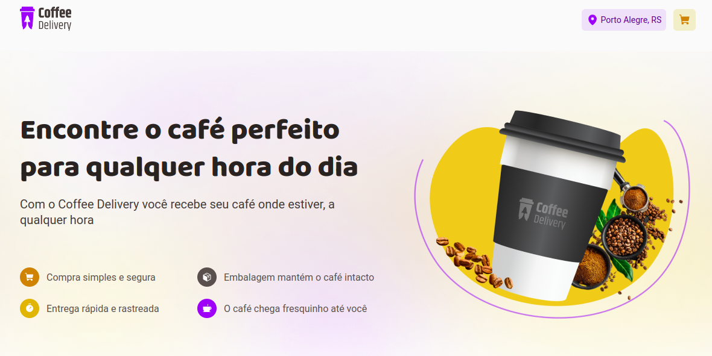

<a id="topo"></a>



<p align="center">
  <a href="https://github.com/RicardoOliveiraFilho">
    
  </a>
  
<p>

<p>
  Projeto de estudos criado referente ao segundo desafio do Ignite da trilha ReactJS. Trata-se de uma aplicação onde
  temos uma loja de cafés. A aplicação fornece um menu, contendo os cafés oferecidos pela loja, onde o usuário informa aqueles que deseja comprar.
  Além disso a aplicação gerencia o carrinho de compras desse usuário, possui um formulário para o usuário informar o endereço da entrega dos cafés e por fim uma página que informa o sucesso da compra.
</p>

<p align="center">
  <a href="#features">Features</a> •
  <a href="#pre-requisitos">Pré-requisitos</a> •
  <a href="#rodando">Rodando a Aplicação</a> •
  <a href="#tecnologias">Tecnologias</a> •
  <a href="#autor">Autor</a>
</p>

### Features<a id="features"></a> - <a href="#topo">Topo</a>
- [x] Lista os cafés oferecidos pela loja!
- [x] Possibilita ao usuário escolher quais tipos de café deseja, como também informar a quantidade de cada um deles!
- [x] Gerencia o carrinho de compras do usuário, que contém os cafés por ele selecionados na página inicial!
- [x] Página de confirmação do pedido, onde o usuário revisa o valor do pedido, seus cafés selecionados, informa o endereço onde deseja que seja entregue bem como a forma de pagamento!
- [x] Página de sucesso que informa ao usuário que seu pedido está a caminho!

<h4  align="left">
Projeto finalizado ✔
</h4>

###  Pré-requisitos<a id="pre-requisitos"></a> - <a href="#topo">Topo</a>

Antes de começar, você vai precisar ter instalado em sua máquina as seguintes ferramentas:
 [Git](https://git-scm.com/),
 [Node.js](https://nodejs.org/pt-br/) 
 e [React](https://reactjs.org/)
 
Além disto é bom ter um editor para trabalhar com o código como [VSCode](https://code.visualstudio.com/) 
 
### Rodando a Aplicação<a id="rodando"></a> - <a href="#topo">Topo</a>
   
````bash 
 # Clone este repositório
 https://github.com/RicardoOliveiraFilho/coffee-delivery.git
 # Acesse a pasta do projeto no terminal, a partir do diretório ao qual o comando de clonagem foi executado
 cd coffee-delivery
 
 # Instale as dependências
 $ yarn ou
 $ npm i 
 
 # Execute a aplicação em modo de desenvolvimento
 $ npm run dev ou
 $ yarn dev
 
 # O servidor iniciará na porta:5173 (Porta padrão utilizada pelo Vite)
 # Acesse http://localhost:5173
 ````

### Tecnologias<a id="tecnologias"></a> - <a href="#topo">Topo</a>
 As seguintes ferramentas foram usadas na construção do projeto:
 
  - [Styled Components](https://styled-components.com/) - Para estilização do projeto!
  - [Node.js](https://nodejs.org/pt-br/) - Apenas como Ambiente de execução!
  - [ReactJS](https://reactjs.org/) - Biblioteca de Componentização de UI!
  - [React Hook Form](https://react-hook-form.com/) - Gerenciar formulários!
  - [Zod](https://github.com/colinhacks/zod) - Validar formulários!

### Autor <a id="autor"> </a> - <a href="#topo">Topo</a>

<a href="https://github.com/RicardoOliveiraFilho" style="text-decoration: none;">

<span> Feito por Ricardo Oliveira - Entre em contato! </span> 
</a>
